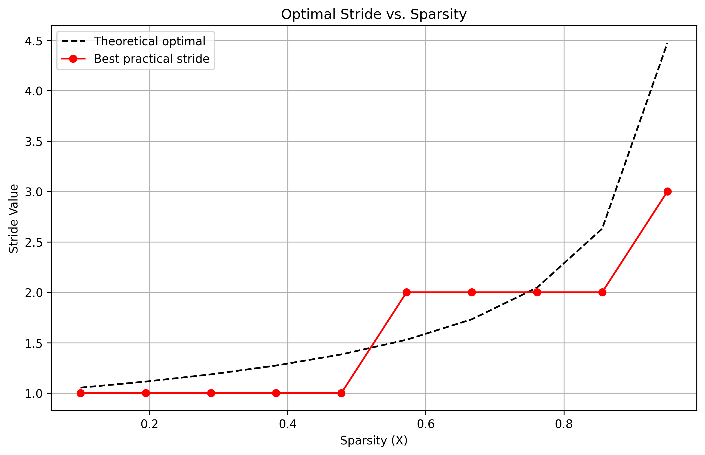
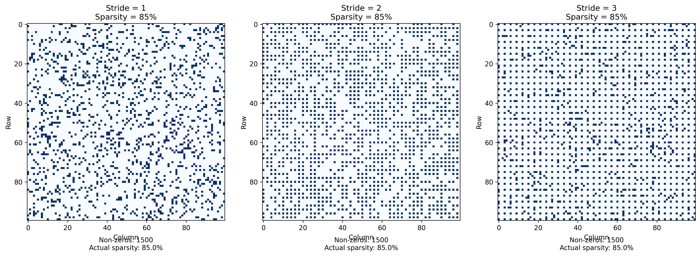
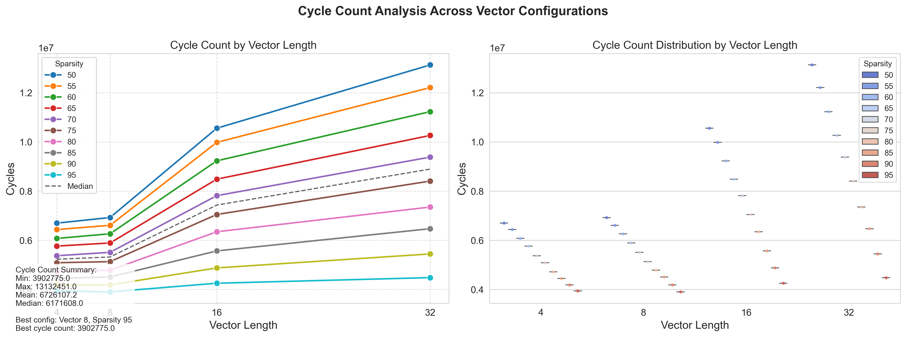
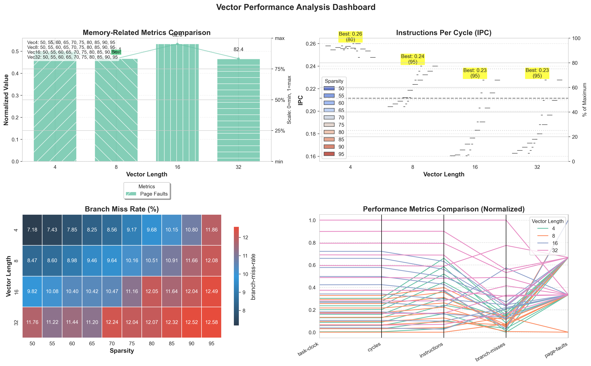

# Report attività MLIR

## Organizzazione
### Struttura delle directory:

```
├── all_results_vector/ (csv merged per tipo di vectorization )
│   ├── all_results_vector_4.csv
│   ├── all_results_vector_8.csv
│   ├── all_results_vector_16.csv
│   └── all_results_vector_32.csv
│
├── analysis_output/
├── analysis_output_stride1/
├── jupiter/
│   ├── analysis_output_stride1/
│   └── stride_grouped_analysis/
├── matrices/
├── mlir_files/
│   ├── build_4/
│   ├── build_8/
│   ├── build_16/
│   └── build_32/
│   	└── mlir_sparsity_<50–95>_stride_<1–4>_vector/ 
│         (repetuta per ogni combinazione di stride e sparsità)
├── python/
├── results_scalar/
├── results_vector/
│   ├── results_vector_4/
│   ├── results_vector_8/
│   ├── results_vector_16/
│   ├── results_vector_32/
│   └── mlir_sparsity_<50–95>_stride_<1–4>.mlir

├── stride_grouped_analysis/
│   ├── stride_analysis/
│   │   ├── stride_1/
│   │   ├── stride_2/
│   │   ├── stride_3/
│   │   └── stride_4/
└── stride_comparison/

# Notes:
# - All `mlir_sparsity_*_vector/` folders are repeated in each build directory.
# - Sparsity levels range from 50 to 95 (by 5).
# - Stride levels go from 1 to 4.
```

### Flusso di lavoro:
Dato che ci sono problemi di liberie python sul Jupiter il flow di test è:
1. Generare file mlir da "python/full_generator_2.py" che verrano inseriti in "mlir_files/" le matrici generate invece sono salvate in "matrices/"
2. Su Jupiter lanciare sia "vector_pipeline.sh" e "scalar_pipeline.sh" che genereranno i file di build, gli eseguibi e su di loro eseguono il comando perf. Questo per tutti i tipi di vectorLength (vl=[4,8,16,32]). 
3. I risultati dei perf vengono inseriti in "result_scalar/" e "result_vector/result_vector_<4-8-16-32>/" sotto forma di csv file
4. In "jupiter/" ci sono una serie di Jupiter Notebook che permettono di vedere graficamente i risultati dei perf e le relazioni tra scalare e le diverse vectorization

## --titolo--
### Studio dello stride
> **Info**  
> "Stride" si riferisce al numero di posizioni di memoria (o step) di cui è necessario disporre per accedere all'elemento successivo lungo una dimensione.

È possibile vedere qual'è lo stride migliore e quali sono gli stride da poter testare tramite il file "jupiter/perfect_stride.ipynb".  
È calcolato tramite la formula:
$$

\left(\frac{N}{S}\right)^2 \approx (1 - X) \cdot N^2  
$$
Dove:
- N è una dimensione delle matrice
- S è lo stride
- X è la sparsità scelta  

Nel codice è così indicata
$$
\text{optimal\_stride} = \frac{1}{\sqrt{1 - \text{sparsity}}}
$$
Nell'output del file è indicato anche il: 
- Theoretical optimal stride: X
- Practical stride values to consider: [...]
- Recommended stride: X




### Visualizzare lo stride delle matrici create

È possibile visualiazzare lo stride delle matrici generate tramite il file "jupiter/MatrixViewer.ipynb" e la comparazione è salvata in "stride_comparison.png"


## Analisi dei grafici
### Confronto tra diverse vector length



### Confronto vector length migliore (4) con performance scalare


## Analisi del Codice Vettoriale RISC-V per Moltiplicazione di Matrici

Ho analizzato il codice assembly per un'implementazione di moltiplicazione di matrici che utilizza le istruzioni vettoriali RISC-V. Questo codice sembra essere il risultato di un processo di compilazione da MLIR (Multi-Level Intermediate Representation) attraverso LLVM fino all'assembly RISC-V, con particolare attenzione alla vettorizzazione.

### Panoramica

Il codice consiste di tre funzioni principali:
1. `matmul` - Un'implementazione vettorizzata della moltiplicazione di matrici
2. `main` - Il punto di ingresso che prepara i dati e chiama `matmul`
3. `test_assemble` - Funzione di supporto per la preparazione dei dati di test

### Implementazione della Moltiplicazione di Matrici

La funzione `matmul` implementa la moltiplicazione di matrici utilizzando le istruzioni vettoriali RISC-V, sfruttando in particolare l'estensione "V" di RISC-V. La funzione è ottimizzata per operazioni su matrici sparse basate sui flag di compilazione mostrati nel tuo script di build (in particolare `-sparsification-and-bufferization` e `-sparse-tensor-codegen`).

```asm
matmul:                                 # @matmul
    # Prologo della funzione - salva i registri callee-saved
    addi    sp, sp, -96
    sd      s0, 88(sp)                  # Salva i registri nello stack
    # ... altri salvataggi di registri ...
```

### Operazioni Vettoriali Chiave

Il codice utilizza diverse importanti istruzioni vettoriali RISC-V:

1. `vsetvli` - Imposta la lunghezza del vettore in base alla dimensione dell'elemento (e32/e64) e alla dimensione del gruppo vettoriale (m2/m4)
2. `vid.v` - Carica interi consecutivi (0, 1, 2...) in un registro vettoriale
3. `vmv.v.i` - Sposta un valore immediato in tutti gli elementi di un registro vettoriale
4. `vmslt.vx` - Crea una maschera basata sul confronto tra elementi vettoriali e uno scalare
5. `vmv4r.v` - Copia un registro vettoriale in un altro (4 registri alla volta per vettori più ampi)
6. `vle64.v` - Caricamento vettoriale di elementi a 64 bit
7. `vse64.v` - Memorizzazione vettoriale di elementi a 64 bit
8. `vfmul.vf` - Moltiplicazione in virgola mobile vettore-scalare
9. `vfadd.vv` - Addizione in virgola mobile vettore-vettore

### Gestione di Matrici Sparse

L'implementazione sembra essere progettata per operazioni efficienti su matrici sparse:

```asm
.LBB0_7:                                #   nel Loop: Header=BB0_8 Profondità=3
    vsetvli  zero, zero, e32, m2, ta, ma
    vmslt.vx v0, v8, a5                # Crea maschera basata sugli indici
    add      a5, s8, s0
    vmv4r.v  v16, v12                  # Inizializza vettori con zeri
    add      a4, s7, a1
    vmv4r.v  v20, v12
    vsetvli  zero, zero, e64, m4, ta, mu
    vle64.v  v16, (a5), v0.t          # Caricamento con maschera (simile a gather)
    vle64.v  v20, (a4), v0.t          # Caricamento con maschera (simile a gather)
    # ... operazioni sui dati caricati ...
    vse64.v  v16, (a5), v0.t          # Memorizzazione con maschera (simile a scatter)
```

### Perché le Tradizionali Gather/Scatter Non Sono Utilizzate

L'estensione vettoriale RISC-V fornisce le istruzioni `vluxei` e `vsuxei` per un vero accesso indicizzato alla memoria (gather/scatter), ma questo codice non le utilizza esplicitamente. Invece, utilizza caricamenti e memorizzazioni con mascheramento (`v0.t` come suffisso). Ecco perché:

1. **Decisione del Compilatore**: La pipeline di compilazione MLIR-to-LLVM-to-RISC-V ha scelto di implementare l'accesso sparso utilizzando operazioni mascherate anziché operazioni indicizzate basate su specifici pattern di accesso.

2. **Strategia di Ottimizzazione**: I flag di compilazione includono `-sparse-tensor-codegen` e `-sparsification-and-bufferization`, suggerendo una strategia specifica per la gestione di tensori sparsi che favorisce l'accesso basato su maschere per questo particolare pattern di calcolo.

3. **Regolarità di Accesso**: L'algoritmo sembra lavorare con formati compressi per matrici sparse dove gli elementi non-zero seguono un pattern più strutturato, rendendo le operazioni basate su maschere più efficienti rispetto a gather/scatter casuali.

4. **Benefici della Predicazione**: L'uso di operazioni predicate consente al codice di eseguire condizionalmente operazioni su elementi vettoriali, che può essere più efficiente di gather/scatter quando si ha a che fare con dati sparsi che presentano località.

5. **Vettorizzazione VLA**: Il flag `enable-vla-vectorization=true` indica che viene utilizzata la vettorizzazione di array a lunghezza variabile, che spesso funziona meglio con approcci basati su maschere per questa struttura algoritmica.

## Considerazioni sulle Prestazioni

L'implementazione utilizza diverse tecniche per le prestazioni:

1. **Programmazione Vector Length Agnostic**: Il codice utilizza `vsetvli` per impostare la lunghezza del vettore in base all'hardware disponibile.

2. **Riutilizzo dei Registri**: Gestione attenta dei registri vettoriali (v8, v12, v16, v20) per minimizzare la pressione sui registri.

3. **Annidamento dei Loop**: La struttura a triplo loop annidato (`.LBB0_2`, `.LBB0_5`, `.LBB0_8`) suggerisce il classico algoritmo di moltiplicazione matriciale i-j-k, vettorizzato lungo la dimensione più interna.

4. **Generazione di Maschere**: Il codice crea maschere utilizzando `vmslt.vx` per operare selettivamente su specifici elementi, essenziale per operazioni sparse.

5. **Precisione Mista**: Il codice passa da operazioni vettoriali e32 (32-bit) a e64 (64-bit) per diverse parti del calcolo per ottimizzare sia l'accesso alla memoria che il calcolo.

### Conclusione

Questa implementazione dimostra un uso avanzato delle istruzioni vettoriali RISC-V per la moltiplicazione di matrici sparse. Piuttosto che utilizzare operazioni esplicite di gather/scatter, impiega caricamenti e memorizzazioni vettoriali con mascheramento e predicazione per ottenere funzionalità simili, sfruttando potenzialmente meglio le caratteristiche delle matrici sparse. L'approccio bilancia l'efficienza della vettorizzazione con i pattern di accesso irregolare alla memoria tipici nelle operazioni su matrici sparse.