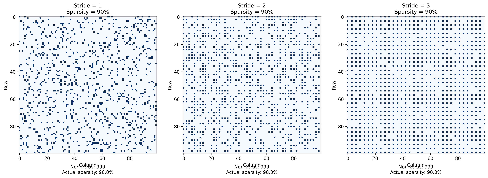

# Report attività MLIR

## Organizzazione
### Struttura delle directory:

```
├── all_results_vector/ (csv merged per tipo di vectorization )
│   
├── analysis_output/
├── analysis_output_stride1/
├── jupiter/
│   ├── analysis_output_stride1/
│   └── stride_grouped_analysis/
├── matrices/
├── mlir_files/
│   ├── build_4/
│   ├── build_8/
│   ├── build_16/
│   └── build_32/
│   	└── mlir_sparsity_<50–95>_stride_<1–4>_vector/ 
│         (repeated for each sparsity and stride combination)
├── python/
├── results_scalar/
├── results_vector/
│   ├── results_vector_4/
│   ├── results_vector_8/
│   ├── results_vector_16/
│   ├── results_vector_32/
│   └── mlir_sparsity_<50–95>_stride_<1–4>.mlir

├── stride_grouped_analysis/
│   ├── stride_analysis/
│   │   ├── stride_1/
│   │   ├── stride_2/
│   │   ├── stride_3/
│   │   └── stride_4/
└── stride_comparison/

# Notes:
# - All `mlir_sparsity_*_vector/` folders are repeated in each build directory.
# - Sparsity levels range from 50 to 95 (by 5).
# - Stride levels go from 1 to 4.
```

### Flusso di lavoro:
Dato che ci sono problemi di liberie python sul Jupiter il flow di test è:
1. Generare file mlir da "python/full_generator_2.py" che verrano inseriti in "mlir_files/" le matrici generate invece sono salvate in "matrices/"
2. Su Jupiter lanciare sia "vector_pipeline.sh" e "scalar_pipeline.sh" che genereranno i file di build, gli eseguibi e su di loro eseguono il comando perf. Questo per tutti i tipi di vectorLenght (vl=[4,8,16,32]). 
3. I risultati dei perf vengono inseriti in "result_scalar/" e "result_vector/result_vector_<4-8-16-32>/" sotto forma di csv file
4. In "jupiter/" ci sono una serie di Jupiter Notebook che permettono di vedere graficamente i risultati dei perf e le relazioni tra scalare e le diverse vectorization

## --titolo--
### Studio dello stride
> **Info**  
> "Stride" si riferisce al numero di posizioni di memoria (o step) di cui è necessario disporre per accedere all'elemento successivo lungo una dimensione.

È possibile vedere qual'è lo stride migliore e quali sono gli stride da poter testare tramite il file "jupiter/perfect_stride.ipynb".  
È calcolato tramite la formula:
$$

\left(\frac{N}{S}\right)^2 \approx (1 - X) \cdot N^2  
$$
Dove:
- N è una dimensione delle matrice
- S è lo stride
- X è la sparsità scelta  

Nel codice è così indicata
$$
\text{optimal\_stride} = \frac{1}{\sqrt{1 - \text{sparsity}}}
$$
Nell'output del file è indicato anche il: 
- Theoretical optimal stride: X
- Practical stride values to consider: [...]
- Recommended stride: X


### Visualizzare lo stride delle matrici create

È possibile visualiazzare lo stride delle matrici generate tramite il file "jupiter/MatrixViewer.ipynb" e la comparazione è salvata in "stride_comparison.png"


## Analisi dei grafici
### Confronto tra diverse vector lenght


### Confronto vector lenght migliore (4) con performance scalare
